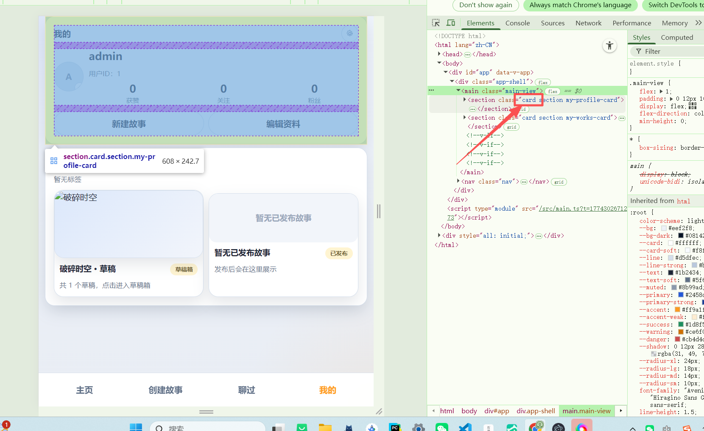
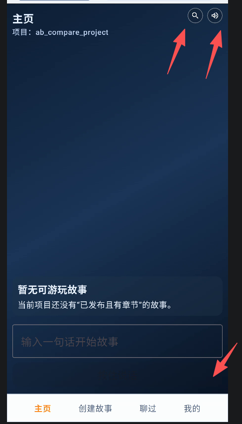
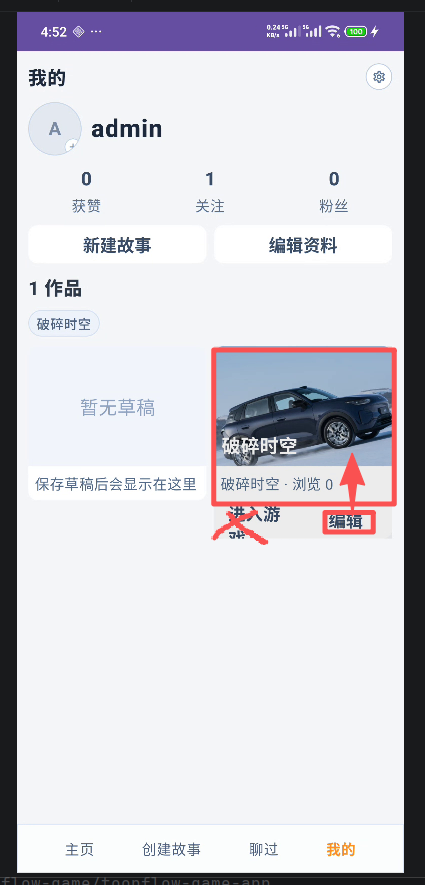
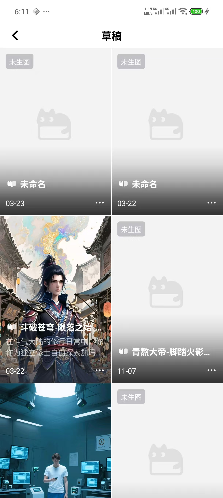

# no_modify
# Toonflow Android-to-Web 界面对比验证文档

- 生成时间：2026-03-24
- 验证范围：Android `Toonflow-game-android` -> Web `Toonflow-game-web`
- 验证方式：源码对照 + `yarn type-check` + `yarn build`
- 结论：主要页面和业务状态已对齐，未发现依赖假数据的页面卡片；剩余差异主要是 Web/Android 运行媒介不同导致的交互实现差异。

## 页面
| 页面 | Android 源位置 | Web 目标文件 | 验证结论 | 说明 |
|---|---|---|------|---|
| 主页 | `MainActivity.kt:323-336, 456-461` | `SceneHome.vue:14-54` | 不通过  |  |
| 故事大厅 | `MainActivity.kt:370-461` | `SceneHall.vue:11-46` | 不通过   |  |
| 创建故事 | `MainActivity.kt:602-1306`、`MainViewModel.kt:841-1018` | `SceneCreate.vue:228-526`、`useToonflowStore.ts:841-1018` | 不通过   |  |
| 游玩页 | `MainActivity.kt:1490-1674`、`MainViewModel.kt:1070-1158` | `ScenePlay.vue:298-520`、`useToonflowStore.ts:1070-1158` | 不通过   |  |
| 聊过 | `MainActivity.kt:1352-1364`、`MainViewModel.kt:1761-1768, 1613-1615` | `SceneHistory.vue:11-39` | 不通过   | |
| 我的 / 设置 | `MainActivity.kt:2127-2254`、`MainActivity.kt:3244-3250`、`MainViewModel.kt:421-439` | `SceneMy.vue:52-116`、`SceneSettings.vue:7-36`、`useToonflowStore.ts:841-905` | 不通过   | |

## 对比list
checkstatus: [] 有fail/suc/ing/wait 多种状态，界面改到完全一致为止
- [fail]  全局
  - [fail] web端不要乱用card 样式。不要乱分块！！！！
- [suc]  主页
  安卓：
  web:
  一整个都fail！！！！！。没有任何一致性可言。垃圾，极度垃圾！！！！
  -  [suc] 重新修改总体效果
  -  [suc] 按钮样式一致性
  -  [wait] 交互一致性
  
- [fail] 我的
  安卓：
  web: 
  - [fail] 重新修改总体效果
  布局一致，风格一致，不能有任何差异
   不要乱用card 样式。不要乱分块！！！！
  - [fail] 按钮样式一致性
  - [fail] 交互一致性，
  所以按钮点击后的效果要一致。弹窗要一致 ，面板要一致，跳转要一致
  - [ing] 同步修改（web 和安卓都要同步修改）
  确保真上传到服务器。web 安卓 上传封面 头像后。两边都要看的见
   
  已发布的记录显示调整 删掉“点击进入游戏”这几个字，因为真正要的效果是点击封面就能进入
  编辑按钮放进框里面去！！！！
   这个点击进入的是草稿箱列表！！！！！这是个入口！！！！ 不管多少个草稿在我的只显示最新修改的封面！！！！
  草稿箱列表展示多个草稿是界面不是框！！！！，点击可以进行删除，编辑等操作。
  草稿箱效果图：

