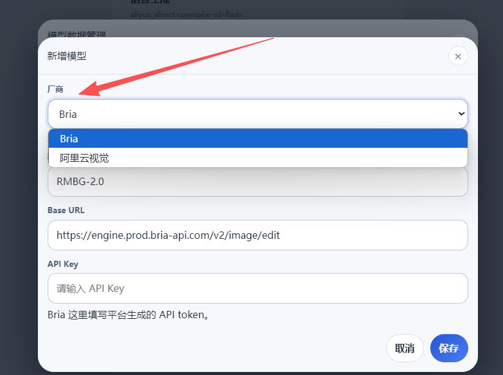

# 把图片分离成主体和背景图
## 快速图像大模型分离路线
特点分离效果不稳定，依靠提示词来调整。文生图硬抠
豆包作为生图模型通常是快速生成
它们的图像生成往往有一些局限性，可能不够精确或在某些复杂场景下出现失真、错位等问题。
## 精密专用图像模型
BRIA的优势可能在于互动性和适应性
BRIA RMBG 2.0 做主体抠图，再用 erase_foreground 生成背景层
BRIA可能采用了更加精密的架构，像是动态自适应的生成策略，能够根据不同用户的输入自动调整生成过程，这使得它在图像的精细度、互动性等方面可能更有优势。

 Bria 是一家做图像生成/编辑 API 的服务商。                                                                                                                                         
  这次我接的不是它的文生图，而是它的图像编辑接口，专门拿来做：                                                                                                                      
                                                                                                                                                                                    
  - remove_background：抠出人物主体                                                                                                                                                 
  - erase_foreground：把人物擦掉，补出背景层                                                                                                                                        
                                                                                                                                                                                    
  官方文档：                                                                                                                                                                        
                                                                                                                                                                                    
  - 背景移除: https://docs.bria.ai/image-editing/v2-endpoints/background-remove                                                                                                     
  - 擦除前景: https://docs.bria.ai/image-editing/v2-endpoints/erase-foreground                                                                                                      
  - v2 说明: https://docs.bria.ai/api_v2_live                                                                                                                                       
                                                                                                                                                                                    
  需要，且是必须要的。                                                                                                                                                              
  Bria 文档里这类接口要求请求头带 api_token。在我们应用里这个值填在“API Key”输入框里，本质上就是 Bria 的 API token，不是 OpenAI 那种 key 名字而已。Bria 的平台入口是：https://      
  platform.bria.ai            
  
“本地分离模型”，例如 BiRefNet / matting 服务，本地部署后就不需要 Bria key 了，硬件要求大。

# 国产有成熟的高精度抠图模型 
国产有成熟的高精度抠图模型 / API可替代 BRIA，且无需 VISA、国内支付
- 阿里云视觉智能开放平台 - 分割抠图
- 腾讯云数据万象 - 人像抠图/智能背景移除
- 火山引擎veImageX - 智能背景移除

缺点：使用复杂，价格高，需要搭配自家的云储存！！！麻烦的一批
## 阿里云视觉智能开放平台=-坑点
 预扣费额度失败？啥玩意？
 [separateRoleAvatar] aliyun matting failed, fallback to image model {"userId":1,"projectId":1,"manufacturer":"aliyun_imageseg","message":"Request failed with status code 400"}
 表面是欠费，实际是阿里产品设计混乱。要开通资源包
# amd 集显就能部署的模型
BiRefNet ONNX （AMD 机首选）
PP-MattingV2 ONNX 格式

# 增加本地开源模型 BiRefNet 的配置选择。
加本地开源模型 BiRefNet 的配置选择。
在，
选择后提示需要安装。确认后自动安装。下次就可以直接选。然后使用
