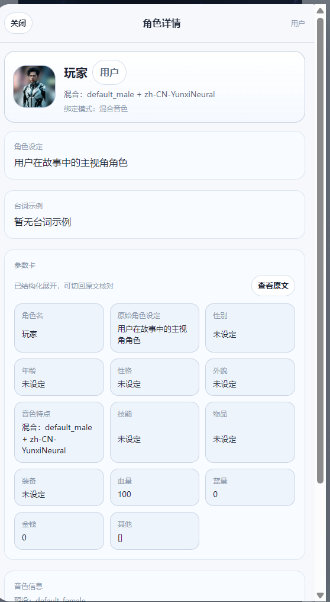
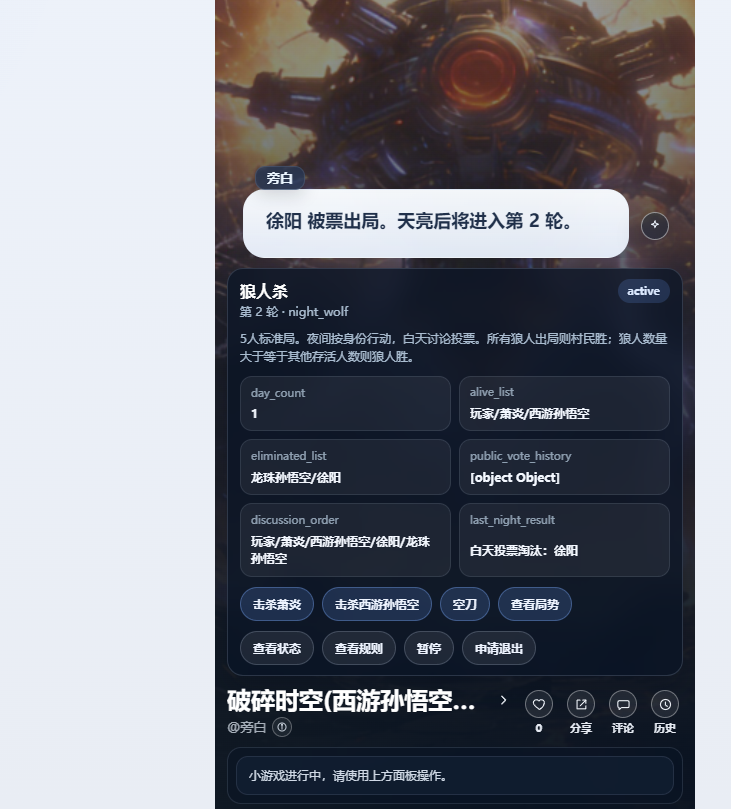
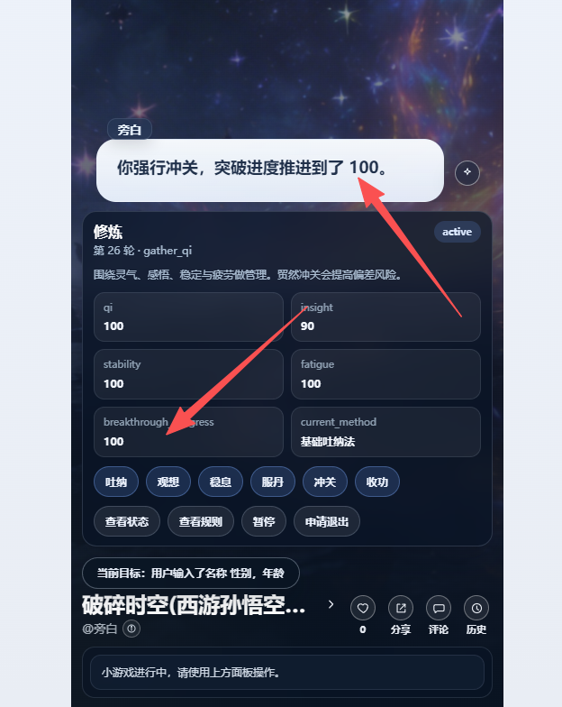

# 频繁的对话是让人疲倦的
所以需要设计一些小游戏开缓冲一下。
## 触发机制
### 主动触发 如用户输入:#狼人杀 #钓鱼 #修炼 #研发技能 #炼药 #挖矿 #升级装备
### 被动触发 例如 一场烧烤 有人提议狼人杀。角色们都基本认同，就可以进入狼人杀模式

## 例如狼人杀：
开局
身份属性
某角色输了
第几轮
这局完毕，胜利者是谁。是否有奖励。是否进行下一局。

这个流程和属性必须被缓存起来。不然ai 会乱飞。而且会剧情乱入 所以要防打断和缓存小游戏的信息！！！

## 小游戏详细设设计
[小游戏控制器提示词.md](%E5%B0%8F%E6%B8%B8%E6%88%8F%E6%8E%A7%E5%88%B6%E5%99%A8%E6%8F%90%E7%A4%BA%E8%AF%8D.md)
[小游戏详细设计与规则方案.md](%E5%B0%8F%E6%B8%B8%E6%88%8F%E8%AF%A6%E7%BB%86%E8%AE%BE%E8%AE%A1%E4%B8%8E%E8%A7%84%E5%88%99%E6%96%B9%E6%A1%88.md)

## 用户输入#小游戏
应该列出有哪些小游戏，用户可以选择一个进入
输入#狼人杀 #钓鱼 #修炼 #研发技能 #炼药 #挖矿 #升级装备 可以直接进入小游戏

# 问题分析
### 钓鱼
钓鱼面板：点击抛竿->等待->有鱼/没鱼-》ai返回什么鱼或者宝物-》用户物品增加这个鱼。退出钓鱼或者再次抛竿。

### 狼人杀

缺少了角色发言的流程和角色投票流程。

### 修炼

修炼成功100 应该有奖励才对。例如角色参数里等级升级。获得感悟什么的

### 研发技能
旁白:开始研发吧。
用户：xxx
旁白:正在为你检查能否研发成功
旁白:恭喜你获得技能xxx/研发失败建议你这么调整:xxxx
最终角色参数里增加这个技能

### 炼药
旁白:开始炼药吧。
用户：xxx
旁白:正在为你检查能否炼药发成功
旁白:恭喜你获得药品xxx/炼药失败建议你这么调整:xxxx
最终角色参数里的物品增加这个药品

### 升级装备
旁白:开始升级装备吧。
用户：xxx
旁白:正在为你检查能否升级装备成功
旁白:恭喜你获得升级成功/升级失败建议你这么调整:xxxx/不好意思你没有这个装备,要不你升级xxx吧
最终角色参数里的物品的这个装备升级成功
例如破魔刀0级-》破魔刀1级（buff附魔）