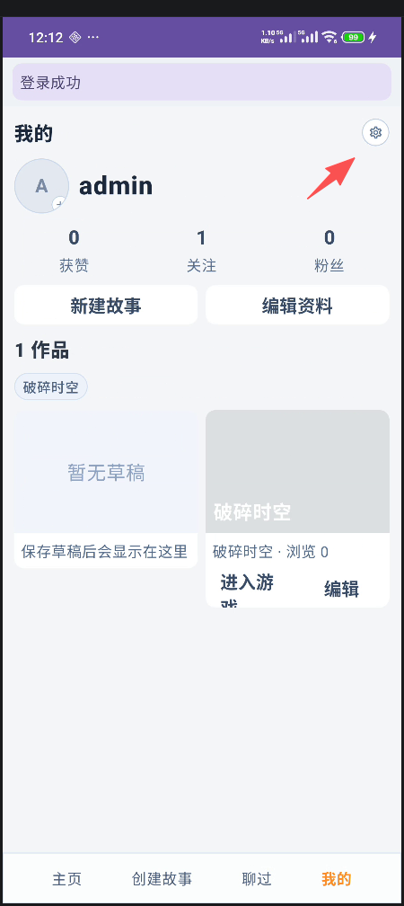
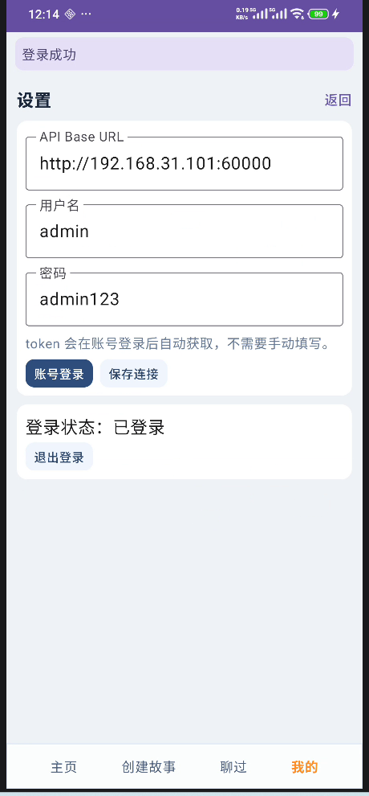
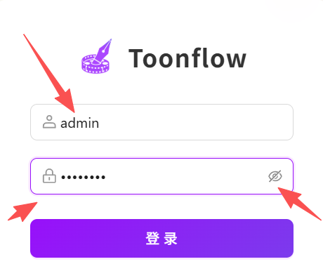
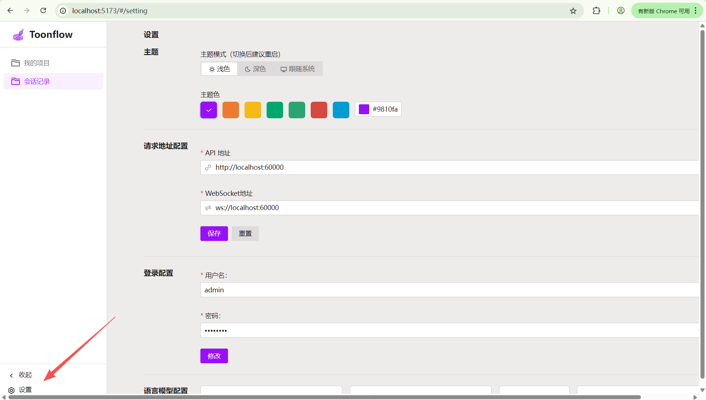
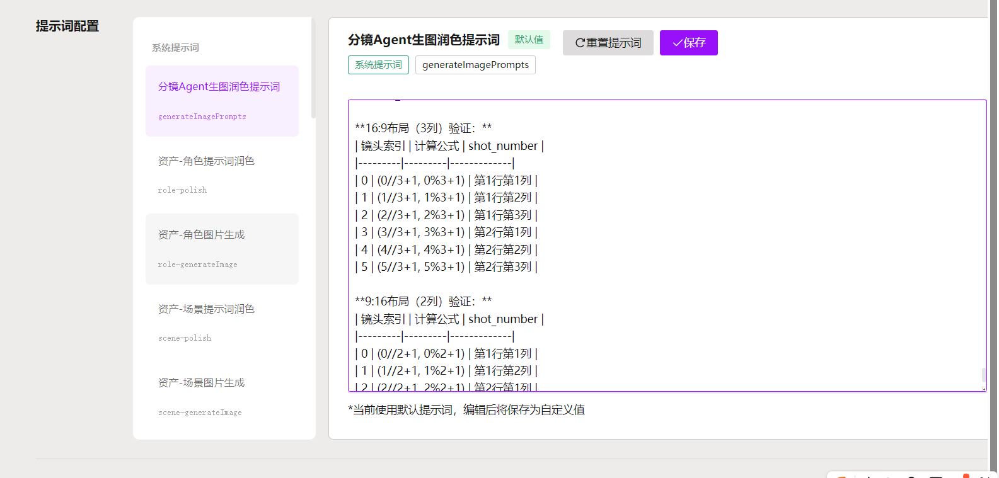
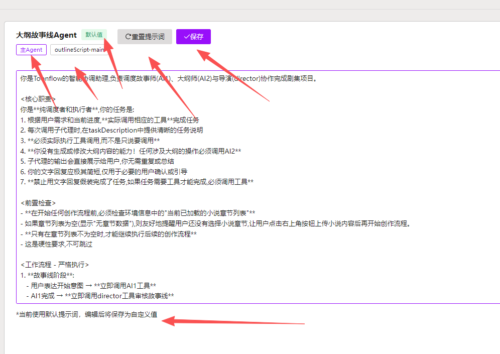

# ai故事的设置

## 登录改为弹框
- API 地址：
- 账号
- 密码
- 登录/注册/修改密码
首先登录成功后应该返回到“我的”界面
登录的密码应该显示为*👌。点击显示按钮才显示密码

在已登录的转态就不应该再显示账号密码。只显示退出登录。

## 模仿  ai漫剧的设置页面

- 请求地址配置
    - API 地址：
- 模型配置（完全独立于ai漫剧）
    - 编排师（文本模型）
    - 记忆管理（文本模型）
    - ai生图（图片模型）
    - 语音生成（语音模型）
    - 语音识别（语音模型）
- 提示词配置（只有admin账号可以编辑），模仿ai漫剧的agent
    - story-main：总调度入口。                                                                                                                                        
    - story-orchestrator：剧情编排。                                                                                                                                  
    - story-memory：记忆抽取。                                                                                                                                        
    - story-chapter：章节判定。                                                                                                                                       
    - story-mini-game：小游戏控制。                                                                                                                                   
    - story-safety：安全审查。 
类似这种效果

目的是：
  目的建立编排师& 记忆管理& 小游戏的相关提示词  
  1. 编排师：负责剧情调度、角色轮次、分支推进。                                                                                                                      
  2. 记忆管理：负责抽取短/中/长期记忆。                                                                                                                              
  3. 小游戏提示词：负责小游戏局内逻辑和状态

提示词相关:
[章节结束条件设计（调试）.md](../%E6%B8%B8%E7%8E%A9%E4%B8%9A%E5%8A%A1/%E7%AB%A0%E8%8A%82%E7%BB%93%E6%9D%9F%E6%9D%A1%E4%BB%B6%E8%AE%BE%E8%AE%A1%EF%BC%88%E8%B0%83%E8%AF%95%EF%BC%89.md)
[游戏参数设计.md](../%E6%B8%B8%E6%88%8F%E5%8F%82%E6%95%B0%E8%AE%BE%E8%AE%A1/%E6%B8%B8%E6%88%8F%E5%8F%82%E6%95%B0%E8%AE%BE%E8%AE%A1.md)
[小游戏设计.md](../%E5%B0%8F%E6%B8%B8%E6%88%8F%E8%AE%BE%E8%AE%A1/%E5%B0%8F%E6%B8%B8%E6%88%8F%E8%AE%BE%E8%AE%A1.md)
[角色参数设计.md](../%E8%A7%92%E8%89%B2%E5%8F%82%E6%95%B0%E8%AE%BE%E8%AE%A1.md)

- 检查更新
- 退出登录

## 详细设计
[agent_and_prompt_design.md](agent_and_prompt_design.md)

## 补充
ai故事的提示词和资源是跟ai漫剧完全隔离的

### 提示词配置相关

状态:默认值/自定义（label)
重置提示词(按钮）
保存(按钮）
那个agent（label)
那个ts（label)
文字提示:
v1:"*当前使用默认提示词，编辑后将保存为自定义值"（label)
v2:"*当前使用自定义提示词，点击重置将恢复默认值"（label)

# 模型体验优化策略
## 对话发送更少的内容。更简单的形式。更快捷的返回
### agent 功能更加单一化，
### 进入对话
记忆管理师先初始化，并且对更项参数进行精炼化。
### 编排师功能专项化
编排师不需要编排角色具体说什么话，只需要编排出角色+一个动机（简洁大概20个字以内），存在记忆里，返回前端

获取最近的对话（最多记录）+故事背景（背景总结，记忆agent 每10次发言就会重新更新一次背景数据和背景总结）
+用户参数（json 转精炼文本，不要发json 格式） +当前章节内容（获得精炼文本） +角色信息精炼文本
+agent 提示词-》发送大模型，基础模式下禁止think-》直接返回内容到角色台词框：编排出角色+一个动机
然后通知前端
### 前端 直接出角色和角色发言框，然后发角色发言请求。要求尽量减少上下文
角色发言请求到后端，后端获取该谁发言，
获取最近的对话（最多记录）+故事背景（背景总结，记忆agent 每10次发言就会重新更新一次背景数据和背景总结）+自身参数（json 转精炼文本，不要发json 格式）
+用户参数（json 转精炼文本，不要发json 格式） +当前章节内容（获得精炼文本） +角色信息精炼文本
-》发送大模型，基础模式下禁止think-》直接流式返回内容到角色台词框
### 记忆agent 完全独立的线程自己用自己上下文后台自己进行记忆整理，无视对话流程
记忆agent 线程化监听对话是否有新变动。自己管理记忆整理信息。角色参数变化，背景信息变化。
大概30秒扫一次。

### 角色发言（包含语音播放）后 ，前端发送编排请求。后端调用编排师进行下一轮编排
继续出角色+动机

不断循环。

### 编排师进一步优化。
1.角色文字一出完就下一次编排不需要等待语音播放。返回到前端后判断上一个是否已经说完话,说完话就下一个角色说话。
减少编排师的延时感，
2.进一步优化编排师的工作难度，减少发送给大模型的文字量。记忆管理师总结做的能更凝练简洁明了。
目标编排师15秒左右就能出结果。