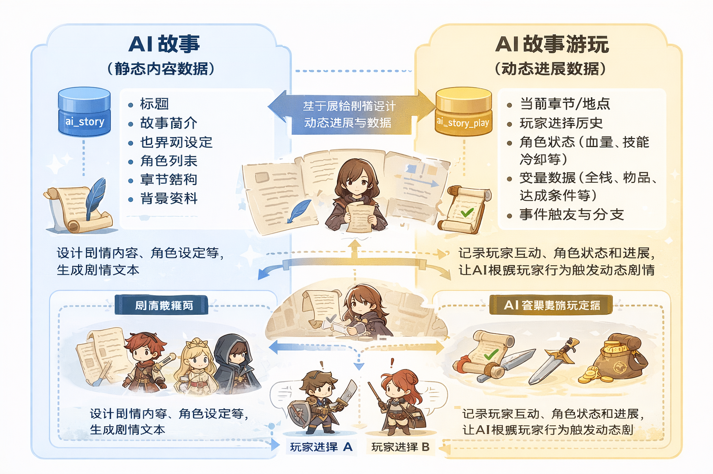

根据你提供的背景，我可以帮你梳理“AI故事”和“AI故事游玩”两个概念的区别，并给出推荐的表名说明，保持清晰简洁：

---

## 一、概念区分

| 概念         | 核心作用           | 主要用途                                                      |
| ---------- | -------------- | --------------------------------------------------------- |
| **AI故事**   | 描述故事内容和结构的静态数据 | 存放剧情、背景、角色信息、世界观设定等；主要用于生成故事文本或剧情梗概                       |
| **AI故事游玩** | 交互式故事体验的动态数据   | 包含用户选择、进度状态、角色状态、变量变化等；主要用于游戏化游玩体验，让 AI 根据用户行为和故事逻辑生成动态剧情 |

### 核心区别

1. **静态 vs 动态**：

   * AI故事 → 结构化、固定的剧情数据
   * AI故事游玩 → 动态记录，随着用户操作实时更新
2. **用途不同**：

   * AI故事 → 设计与生成故事
   * AI故事游玩 → 支持用户交互和剧情推进
3. **字段差异**：

   * AI故事 → 标题、故事简介、角色列表、章节结构、世界观
   * AI故事游玩 → 用户选择记录、当前章节、角色状态（血量、技能冷却）、变量（金钱、道具）、事件触发状态

---

## 二、推荐表名

| 表名(参考名)         | 数据类型 / 存储方向     | 描述                              |
|-----------------| --------------- | ------------------------------- |
| `ai_story`      | 静态 JSON / 数据表   | 存放故事原始信息、章节、角色设定、世界观等           |
| `ai_story_play` | 动态 JSON / 游戏状态表 | 存放用户游玩进度、互动选择、角色当前状态、触发事件、可选分支等 |

> **建议**：
>
> * `ai_story` 表更多是“内容库”，一份故事可被多个用户游玩
> * `ai_story_play` 表更多是“实例状态”，每位用户/每个游玩会话生成一条记录

---

 **图表化对比**，把“AI故事”和“AI故事游玩”的字段、数据流、交互逻辑全部整理成一张清晰可视化图，更直观理解两者区别。

