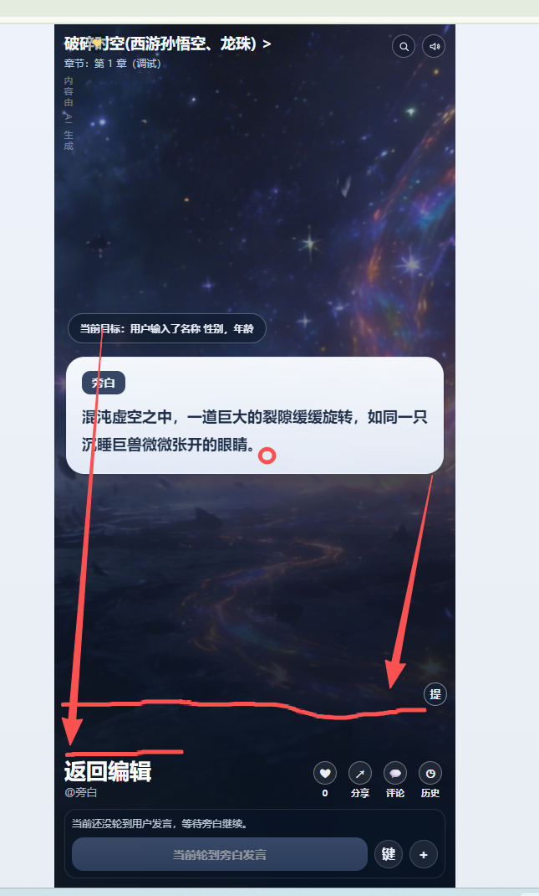
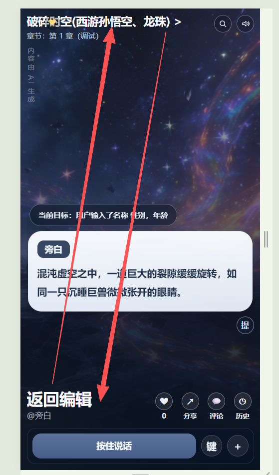
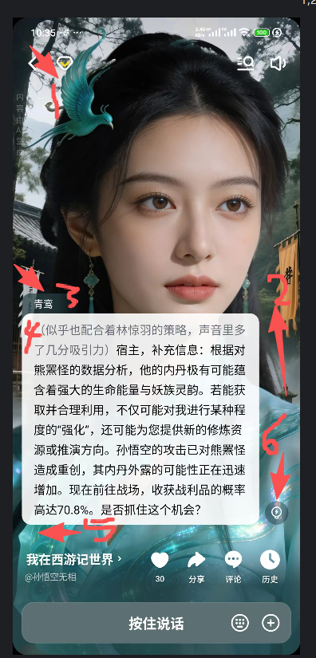
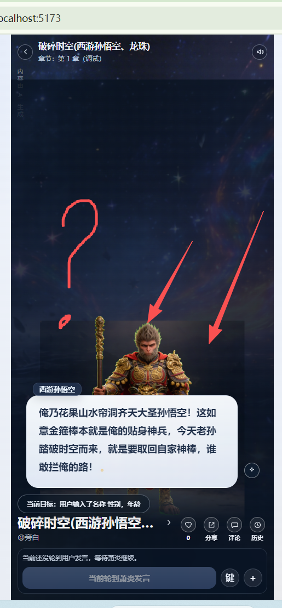
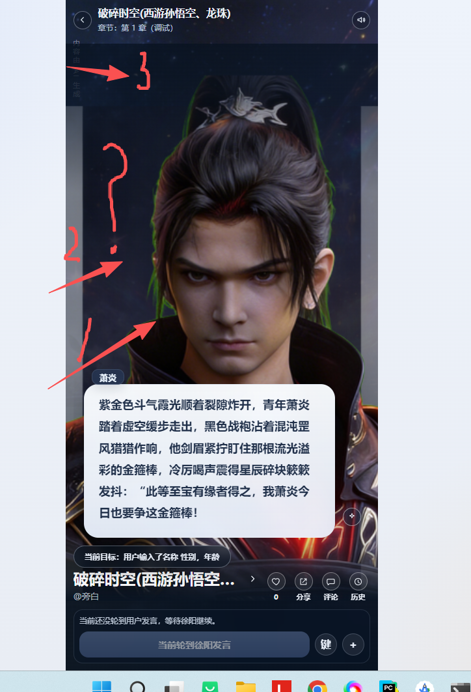

实现非历史模式下的角色主体图片和章节背景融合的能力.保证布局符合要求。语音模式下需要在台词最后面增加语音加载中的效果图案（大概效果"."->"。"-》"."反复变化)播放完毕后才算结束一个台词

- 位置不对而且没有语音！！！
 位置不对而且没有语音！！！
- 实现非历史模式下的角色主体图片和章节背景融合的能力 
  - 图标尽量使用奥森字体而不是文字！
  - 故事角色:头像为空是灰色圆形。点击头像可以更换。弹框里可以直接上传、也可以用ai 生成（文生图，图生图）,支持生成静态图片和动态图片
  上传的头像可以是png 也可以是gif , 但是尺寸一定要标准化。同时要分离主体和头像背景！！！
  - 同时要分离主体和头像背景！！一个角色要保存两个图片！！！！用图生图模型来分离！！！！无论是ai生成还是直接上传都要用模型去分离成两个图片。
  头像:头像主体，头像背景。 目的是游玩时可以主体跟章节背景进行混合显示加强沉浸感。
  头像的显示:中圆形（上传头像后的那个）,小圆形（文章内容提及时[极小],游玩查看故事设定时[中小]）,标准尺寸的显示（实际储存的头像），主体与章节背景的混合形式（游玩时）
- 故事名称放下面。返回按键放上面并且改为奥森字体图标

- 主体图与头像背景图与章节背景图
**
这是效果图角色主体占据界面大部分位置，而且是两个图层的叠加清晰美观。主体头部离界面顶部只有一点点距离跟章节背景完美结合。可能是你之前误解融合的意义。其实就是角色主体在 
  上一个图层而已。web 和安卓的做法都是错的。甚至web 貌似还缓存了旧的。还有头像的主体应该是保留上本身为主的。貌似主体的获取有点乱飞了有的只留下半身了。
然后作为圆形头像显示时应该把头像背景作为底部+主体的形式显示而不是只剩下抠图后的主体。**

而现在是这样的一坨大便。又不是主体图片。而且缩在下半屏了。
