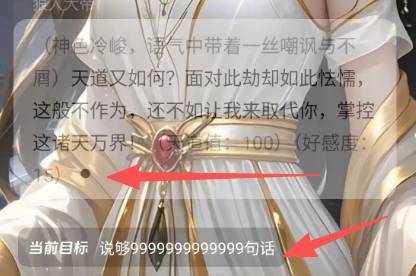

# 故事编辑时的章节调试功能
[@md/plan/ai_game/V3/demo/v2/index.html] [@md/plan/ai_game/V3/设计/android.md:53-64] 漏了调试按钮，
点击后直接进入调试模式跟 游玩界面一致的。
只是故事直接从当前章节开始，所有数据都不会持久化。只以调试缓存方式保存。 达到结束条件就进入下个章节。没有结束约束就一直调试。可以手段返回。 没 
有下一个章节，结束是“已完结”“已失败” 的弹框.
所以需要一个 剧情编排师.

点击调试按钮时先自动保存一下内容。
# 调试和正式发布后
发布后的运行是也是需要编排师的
## 编排师等agent 的工作
- 安排剧情
- 谁说话，说什么话
- 加载记忆
[游戏参数设计.md](../%E6%B8%B8%E6%88%8F%E5%8F%82%E6%95%B0%E8%AE%BE%E8%AE%A1/%E6%B8%B8%E6%88%8F%E5%8F%82%E6%95%B0%E8%AE%BE%E8%AE%A1.md)
[角色参数设计.md](../%E8%A7%92%E8%89%B2%E5%8F%82%E6%95%B0%E8%AE%BE%E8%AE%A1.md)
- 章节结束条件判断
有没有结束条件；
是否结束，是成功还是失败；
是否有下一个章节。
- 游戏状态判断
是否进入小游戏
在那个场景等等等
[vedio_editor](../../../vedio_editor)

# 例子说明-章节1 调试
[游戏参数设计.md](../%E6%B8%B8%E6%88%8F%E5%8F%82%E6%95%B0%E8%AE%BE%E8%AE%A1/%E6%B8%B8%E6%88%8F%E5%8F%82%E6%95%B0%E8%AE%BE%E8%AE%A1.md)
[角色参数设计.md](../%E8%A7%92%E8%89%B2%E5%8F%82%E6%95%B0%E8%AE%BE%E8%AE%A1.md)
[模型配置设计.md](../%E6%A8%A1%E5%9E%8B%E9%85%8D%E7%BD%AE%E8%AE%BE%E8%AE%A1/%E6%A8%A1%E5%9E%8B%E9%85%8D%E7%BD%AE%E8%AE%BE%E8%AE%A1.md)
[小游戏设计.md](../%E5%B0%8F%E6%B8%B8%E6%88%8F%E8%AE%BE%E8%AE%A1/%E5%B0%8F%E6%B8%B8%E6%88%8F%E8%AE%BE%E8%AE%A1.md)
[analysis_ai_game.md](../%E8%AE%BE%E8%AE%A1/analysis_ai_game.md)

## 流程说明
- 加载 提示词配置
- 编排师agent 加载记忆
  - 长期记忆-故事的基础参数-如故事背景（游玩中产生的动态值而不是故事写死的那个）。游戏参数。游戏的角色参数。小游戏机制等
  - 中期记忆-章节内容。重要的事件和内容。 记忆管理agent 不断在后台对进行挖掘聊天内容例如用户输入内容后。 生成记忆目录（等于记忆的索引方便查找记忆替代全文搜索）和重要信息。
  - 短期记忆-最近聊天记录
- 章节1 比较特殊有开场白。 说完开场白后正式进入第一章
- 编排师agent 开始读取记忆进行编排
  - 根据当前章节内容 谁说话，说什么话。
  - 章节进度、场景进度、主支线任务进度。
  - analysis_ai_game.md 的相关事宜。特别是事件树
  - 章节是否结束的判断
  - 不断更新动态数据。游戏动态参数和角色动态参数
  - 小游戏触发和状态判断。防打断。用户输入“#退出”可以强行退出小游戏。输入“#小游戏” ”#xxx“可以进入对应的小游戏， 
- 编排师agent 对章节是否结束的判断。
编排师会自动判断是积极推进剧情发展到结束条件。 还是非积极
例如：章节结束条件是：用户打败徐阳
那么剧情就制作用户打败徐阳 的事件。推进剧情。用户如果暂时不去打徐阳。就会根据为什么这样继续编排剧情

例如：章节结束条件是：用户离开某个地方，说出什么话。
这就是非积极的推进的结束。

# 谁说话，说什么话 。是剧情编排也是角色调度器
例如如果是第一章，就先根据设置。某角色说出开场白。
然后编排师分析三种记忆。特别是当前章节的章节内容。然后进行角色调度。
注意没轮到用户说话时，用户不能输入内容和发送语音！！！
如果是旁白类的内容旁白来说明。例如一些环境啊时间啊事件的说明。还有剧情的发展等。
然后就会根据最新说的话根据合理性开始调度下一个角色（不是顺序而是剧情合理性）说话。以此类推。不断发展剧情和对话。
如果轮到用户说话。用户不想说话。就可以直接发个“.” 跳过下一个角色继续发言。

“(...)”,"[...]" 小挂号和中挂号 里面的内容属于特殊内容。 文字转语音时不要读出来。
特殊内容： 例如os, 好感度。情绪。 血量 蓝量变化等。
而用户还可以通过特殊内容去实现推进剧情发展，表达行为而不是言语 例如
“（我离开了）”
“好啊（内心真实想法是好你妹）” 这种情况要合理地认为角色是看出来内心想法。还是看不出。

万能角色(角色设定里有说到是万能角色的角色)如“路人甲” 可以扮演各种人物 例如
路人甲：（扮演唐三藏）徒儿你不要杀生
路人甲：（扮演狐狸精）哥哥，哥哥
某女子：...
某男子：...
如果没有创建万能角色。那么旁白本身就是一个特殊的万能角色。

## 章节结束条件判断
  - 失败 例如用户被徐阳打死了
  - 成功 用户打败了徐阳，有下一个章节就进入下一个章节。没有就点击确认后进入自由剧情。编排师继续编排剧情
  - 没有设置结束条件。 那就一直自由剧情

## 游戏参数和角色参数的显示
不要直接显示json 格式。而是 字段的中文名称：参数值 的形式显示。而且需要有滚动条。

## 调试进入的流程
- 显式在前端显示正在干嘛
保存草稿-》进入调试界面-》创建这次会话环境-》读取记忆-》准备剧情编排完毕
- 正式开始剧情编排
前端发送编排请求-》剧情编排->流式输出第一个角色的台词。如果开语音。转成语音播放。播放完毕
前端发送编排请求-》剧情编排-》选角色-》流式输台词。如果开语音。转成语音播放。播放完毕
。。。。
剧情编排通知前端到了用户发言：用户输入内容或者语音
-》剧情编排....
- 过程中不断检查“成功条件（章节结局）”，是否需要修改游戏参数、角色参数等，记忆管理师也后台工作等等等。

## 非聊天历史模式时
参考
[android.md](../%E8%AE%BE%E8%AE%A1/android.md)
的游玩故事部分的说明
默认即非历史模式是只会显示一条记录，可以更好的看见角色头像和章节背景图片。

标1:角色的主体图
标2:章节的背景图
表3:角色名称
表4:角色的台词
标5:与底部故事名称的间距
标6:ai 提示可以怎么回答的按钮

语音加载和播放中效果（大概效果"."->"。"-》"."反复变化)
节结束条件可见时的效果。显示为“当前目标：20个字。。。”点击可以查看结束条件详细

实现非历史模式下的角色主体图片和章节背景融合的能力.保证布局符合要求。语音模式下需要在台词最后面增加语音加载中的效果图案（大概效果"."->"。"-》"."反复变化)播放完毕后才算结束一个台词

- 位置不对而且没有语音！！！
 位置不对而且没有语音！！！
- 实现非历史模式下的角色主体图片和章节背景融合的能力 
  - 图标尽量使用奥森字体而不是文字！
  - 故事角色:头像为空是灰色圆形。点击头像可以更换。弹框里可以直接上传、也可以用ai 生成（文生图，图生图）,支持生成静态图片和动态图片
  上传的头像可以是png 也可以是gif , 但是尺寸一定要标准化。同时要分离主体和头像背景！！！
  - 同时要分离主体和头像背景！！一个角色要保存两个图片！！！！用图生图模型来分离！！！！无论是ai生成还是直接上传都要用模型去分离成两个图片。
  头像:头像主体，头像背景。 目的是游玩时可以主体跟章节背景进行混合显示加强沉浸感。
  头像的显示:中圆形（上传头像后的那个）,小圆形（文章内容提及时[极小],游玩查看故事设定时[中小]）,标准尺寸的显示（实际储存的头像），主体与章节背景的混合形式（游玩时）
- 故事名称放下面。返回按键放上面并且改为奥森字体图标

- 主体图与头像背景图与章节背景图

这是效果图角色主体占据界面大部分位置，而且是两个图层的叠加清晰美观。主体头部离界面顶部只有一点点距离跟章节背景完美结合。可能是你之前误解融合的意义。其实就是角色主体在 
  上一个图层而已。web 和安卓的做法都是错的。甚至web 貌似还缓存了旧的。还有头像的主体应该是保留上本身为主的。貌似主体的获取有点乱飞了有的只留下半身了。
然后作为圆形头像显示时应该把头像背景作为底部+主体的形式显示而不是只剩下抠图后的主体。