# 1.主页

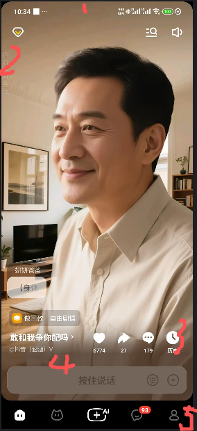
分为5个区域
1.手机自己自带的信息区域包含电量等。后面不再复述
2.每次进入都不同的随机推荐故事。用户点击可以进入故事。
3.推荐故事的信息：故事名称，点赞量，评论，收藏量等
4.用户输入框。用户一旦输入后就会在游玩记录里可以找到。最新的放在最前面
5.菜单栏（第二个是ai朋友不要了）
包括：主页，创建故事，聊过（游玩记录），我的

# 2.故事大厅
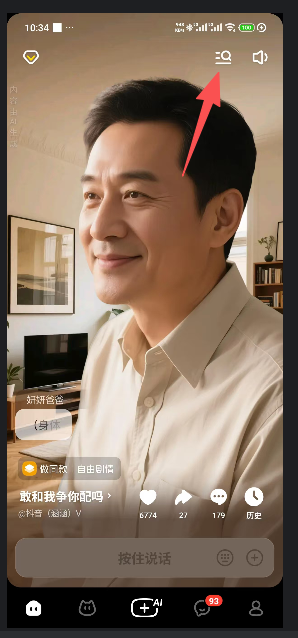
点击这个按钮后进入故事大厅

故事会分类展示，可以进行搜索查找
点击后，用户输入框输入信息后才会聊过里出现

# 3.创建故事
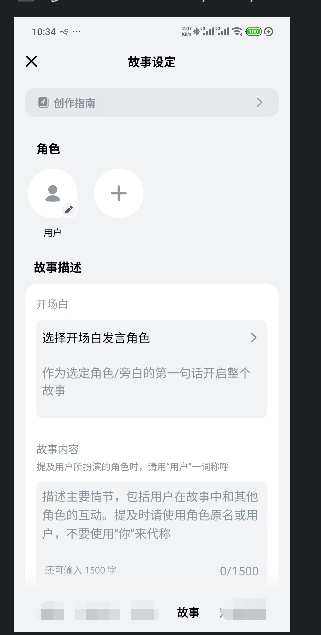
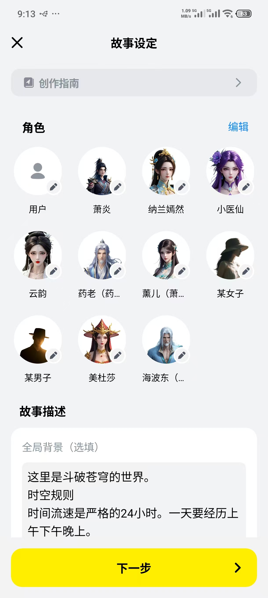
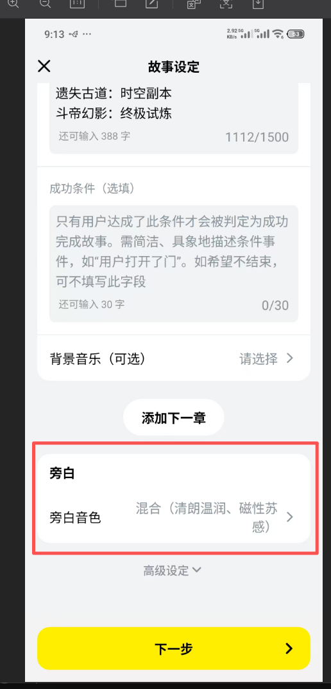

## 1.角色
- 用户是故事里固定的角色不可删除。
何为用户？就是游玩这个故事的用户
用户的字段全部运行为空
 - 字段
   - 头像（可以上传，可以ai生成），这是游戏里的用户头像不是账号里的！！！！
   - 用户名
   - 角色设定
   - 音色选定
   - 角色参数卡（创建时不显示，在游玩时可以看见，是根据角色设定生成json 格式）
   
- 旁白是最特别的角色，不显示在角色列表，可修改的只有音色。负责说旁白
   在角色列表后面显示只能修改音色。
- 其他角色
 - 字段
   - 头像（可以上传，可以ai生成）
   - 角色名
   - 角色设定
   - 角色音色 
   - 台词示例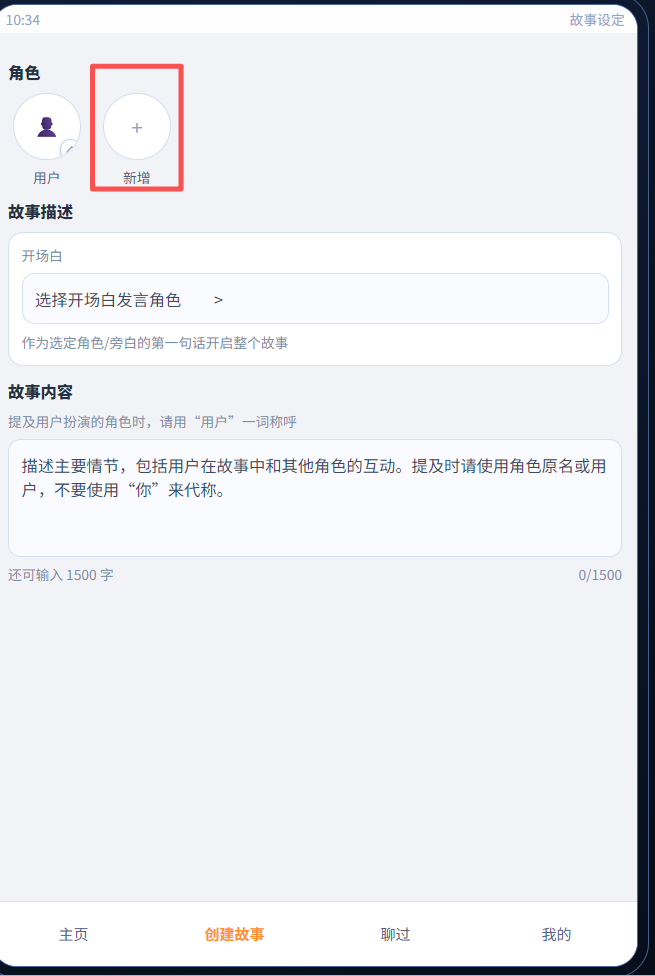
   - 角色参数卡（创建时不显示，在游玩时可以看见，是根据角色设定生成json 格式）
   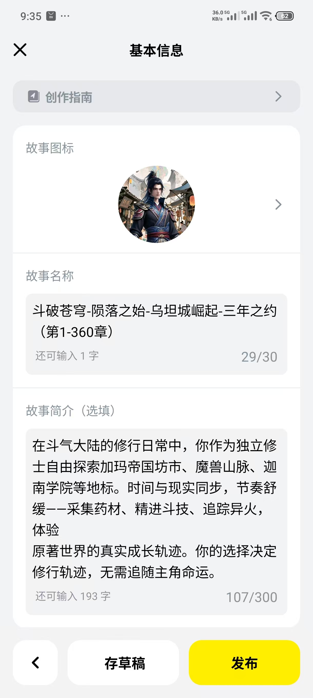
   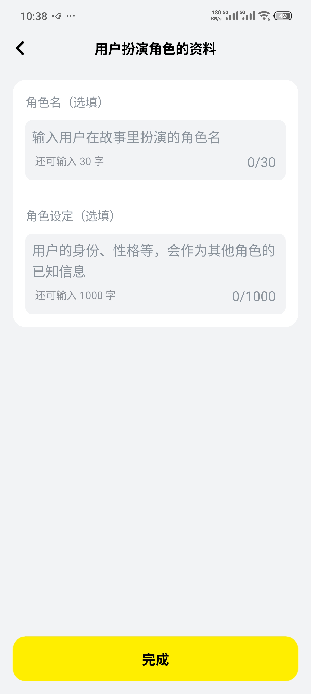

点击头像-》上传/ai 生图-》ai 生图面板如下
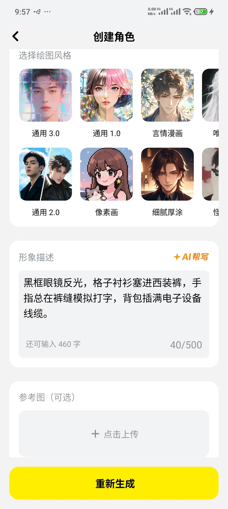
可以根据设置里的“图片编辑”选择的模型来生图
支持文生图，图生图(支持一个或者多个图)。
再给个web版作为参考
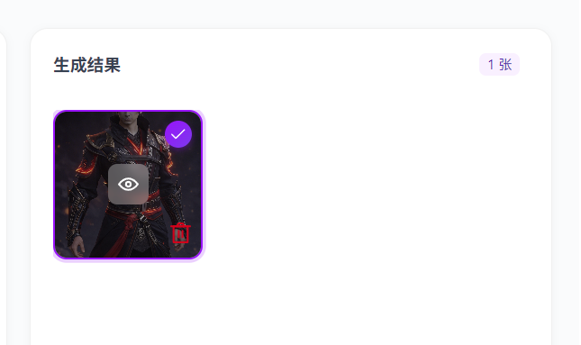

语音绑定
点击音色设置按钮->音色设置面板。如下
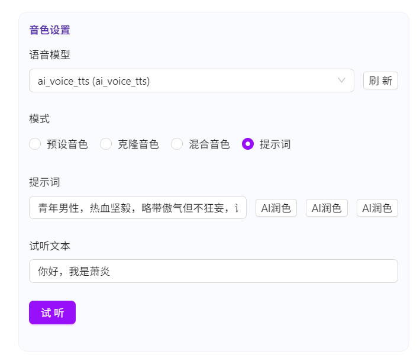

## 2.故事描述
- 全局背景（选填）重要的信息请放最前面
  多行输入框
  - 提及：列出角色列表，点击插入到全局背景光标位置
   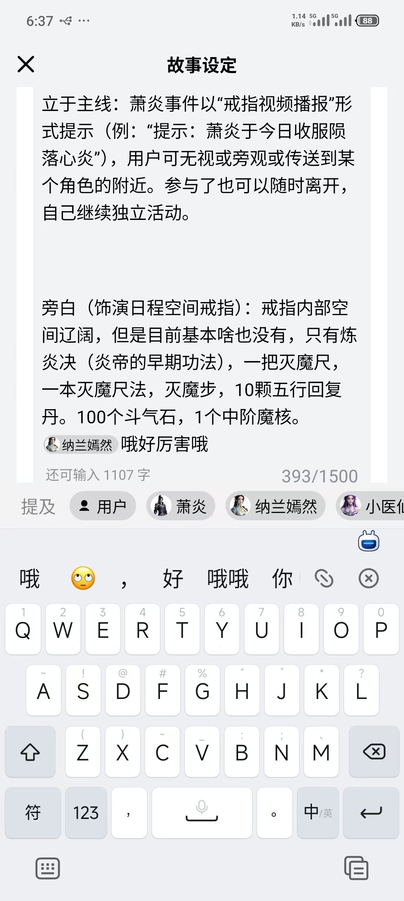
- 章节内容
  - 章节1
    - 章节背景图片（可以上传，可以ai生成）
    - 开场白（只有章节1有）
      - 角色
      - 台词
      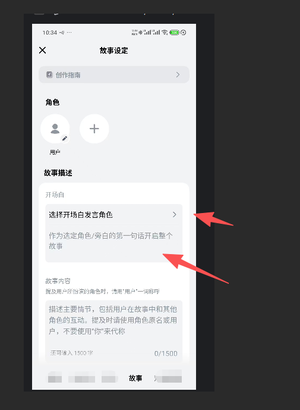
    - 章节内容
      - “章节内容”这四个字旁边有个调试按钮单独调试这个章节
      - 说明： 提及用户所扮演的角色时,请用"用户" 一词称呼
      - 章节内容
      - 提及：列出角色列表，点击插入到章节内容光标位置
      
   - 章节结局
    用于给ai判断是否进入下一个章节。为空代表无结束。ai 无限编排故事
   - 结局条件对用户可见（开关）
   - 背景音乐（可选）
    可选预设音乐（现在无），也可以上传
  - 章节n。。。
  - 他人可查看角色设定（开关）
  - 他人可分享对话剧情（开关）
   知道是用户自己游玩的过程。就是角色都说了什么的内容。
  - 下一步（点击进入下一个面板）
    - 故事图标
    - 故事名称
    - 故事简介
    - 存草稿
    - 发布
    

- 点击创建故事-初始转态:
  - 角色：
    - 用户
  - 故事描述
    - 全局背景（选填,只有一个章节时不显示）
    - 章节1 （只有一个章节时不显示章节1这三个字）
      - 开场白
      - 选择开场白发言角色
      - 开场白填写框
      - 故事内容 (章节内容)
      - 成功条件（章节结局）
  - 添加下一章节（按钮）
  - 帮白面板
  - 旁白音色
  - 高级设定（展开后显示两个开关）
  - 下一步（点击进入下一个面板，交互是填好章节1才显示的。原型直接显示就好）

## 持久化机制
点击下一步。存草稿。发布。 都会触发持久化机制
编辑头像，各种开关，文字内容。也会触发持久化机制，但是可以进行撤回操作。

# 4.聊过

展示聊过的故事，点击可以继续聊
特点:一个故事对应多个用户。但是同一个用户一个故事只能有一个聊过的记录

# 5.我的
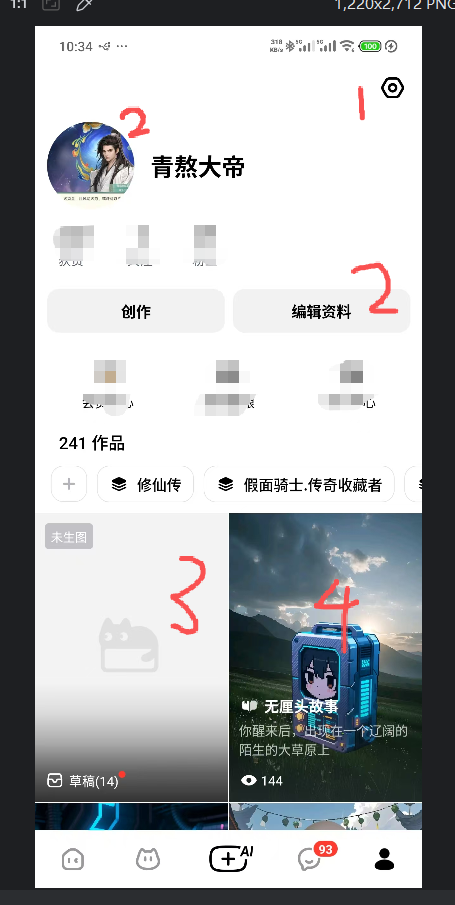
1.设置，在顶部最右边，点击可以配置各种设置
等效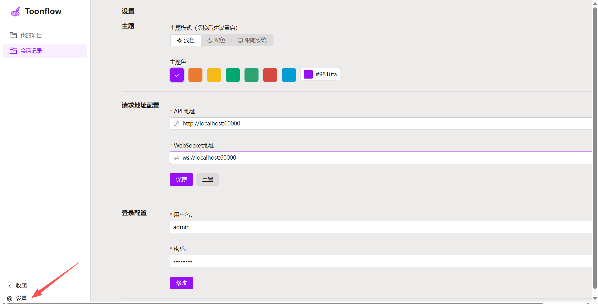
另外:可以进行退出登录,然后就可以重新登录和注册等操作

2.当前登录账号的头像和名称

3.草稿箱入口
第一个是草稿箱入口，显示最新编辑过的草稿的封面，点击进入草稿箱
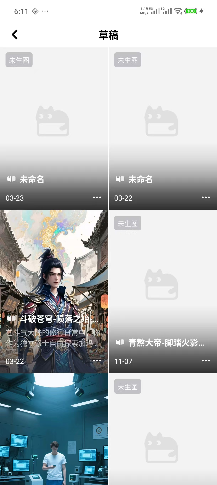
4.已发布的故事
第二个开始就是已发布的故事，点击可以进行游玩和编辑、删除等操作

# 6.游玩故事
## 1.故事
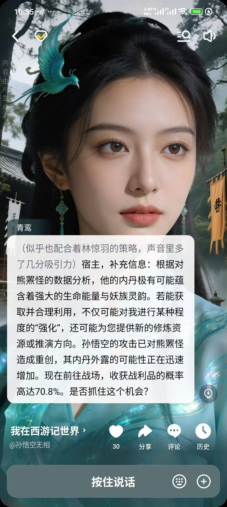
默认是只会显示一条记录，可以更好的看见角色头像和章节背景图片

## 2.历史记录形式
点击历史后是这效果
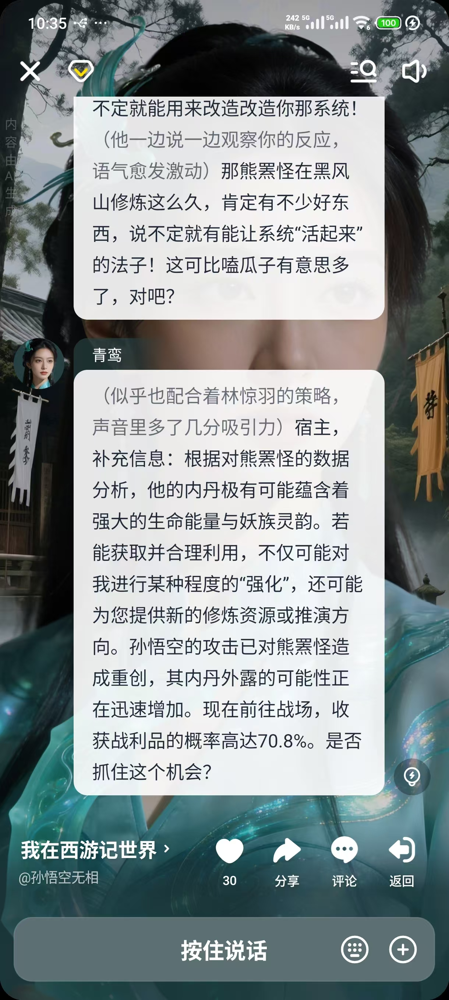
点击历史记录后，会展示更多的聊天记录，上下滚动查看历史记录。
这个时候是不需要点击返回按钮的。它依然可以正常对话，只是对话布局不一样。
用户发送文字或者语音后自动跳到最后

## 故事设定
点击故事名称后
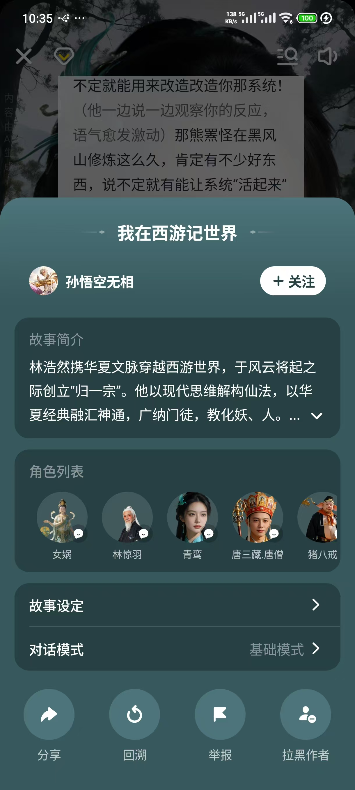
可以查看角色和故事的所有信息（他人可查看角色设定的这个开关打开的话）
点击角色可以查看角色的信息
点击故事设定可查看：故事背景，章节内容，章节完成条件等
对话模式，点击可以选择一个模式。不过暂时只有一个基础模式

## 语音发送

会自动转换为文字发送。ai 会纠正识别的错别字

也可以点击文字输入按钮转换为文字输入方式。不会自动转换会语音输入模式，需要手段切换
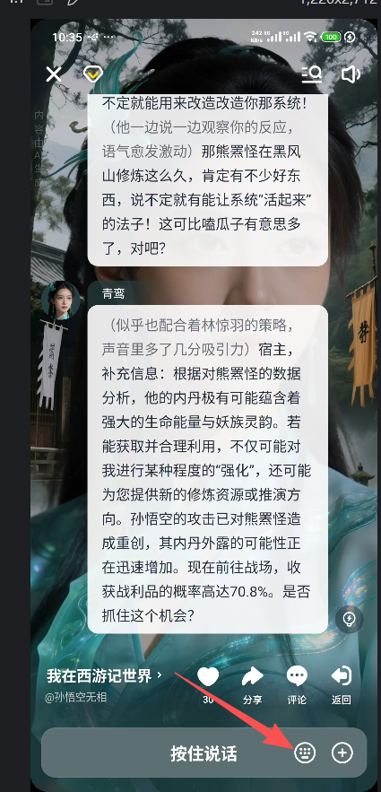

## 角色对话内容的长按

角色对话内容的长按（原型已双击来模拟）
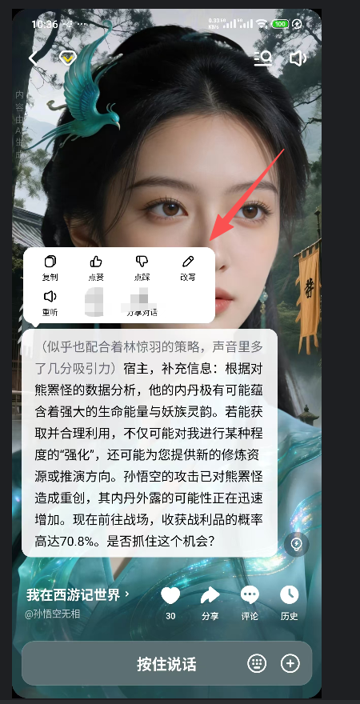
复制
重听
点赞
点踩
改写
重听（重新播放语音）

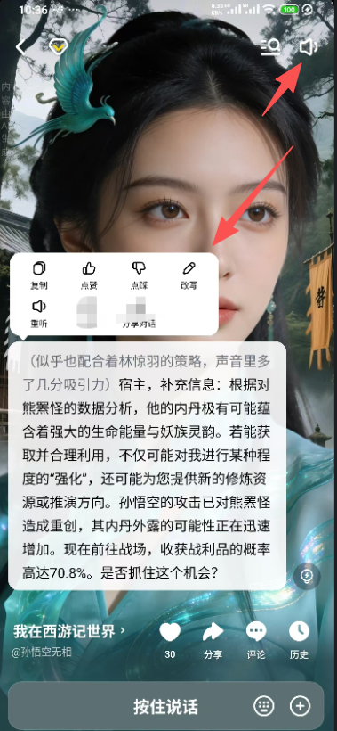
这里可以开关角色发言是否知道播放语音

## ai 提示可以怎么回答
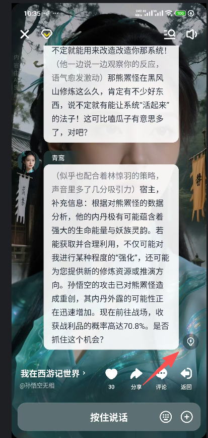
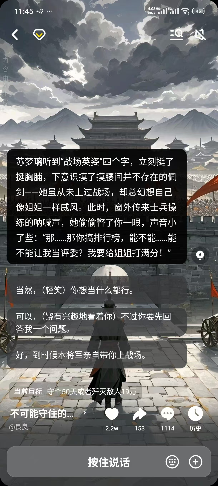
用户可以直接从三个可选选项选一个。也可以返回不选

## 补充说明
- 图标尽量使用奥森字体而不是文字！
- 头像为空是灰色圆形。点击头像可以更换。弹框里可以直接上传、也可以用ai 生成（文生图，图生图）,支持生成静态图片和动态图片
上传的头像可以是png 也可以是gif , 但是尺寸一定要标准化。同时要分离主体和头像背景！！！
头像:头像主体，头像背景。 目的是游玩时可以主体跟章节背景进行混合显示加强沉浸感。
头像的显示:中圆形（上传头像后的那个）,小圆形（文章内容提及时[极小],游玩查看故事设定时[中小]）,标准尺寸的显示（实际储存的头像），主体与章节背景的混合形式（游玩时）

- ai故事（游戏）的提示词和资源是跟ai漫剧完全隔离的