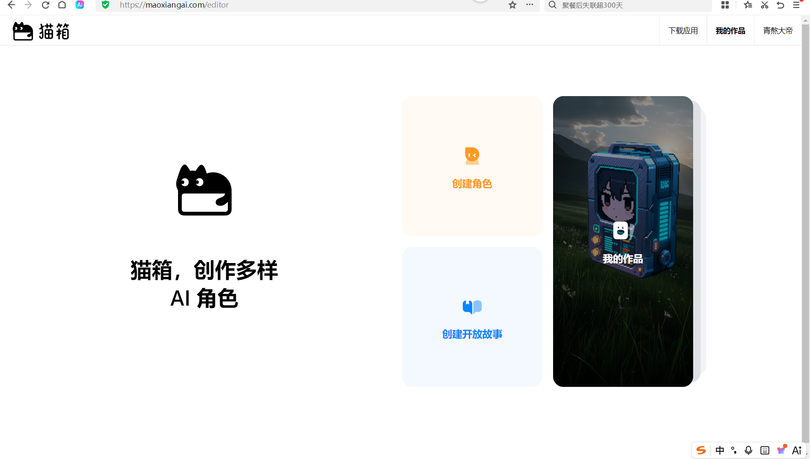
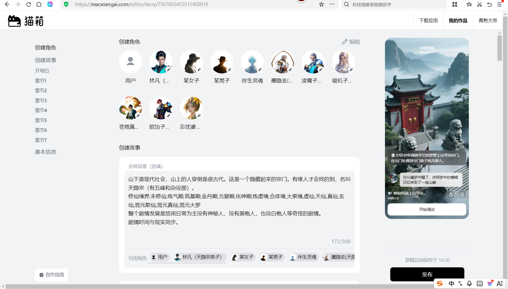
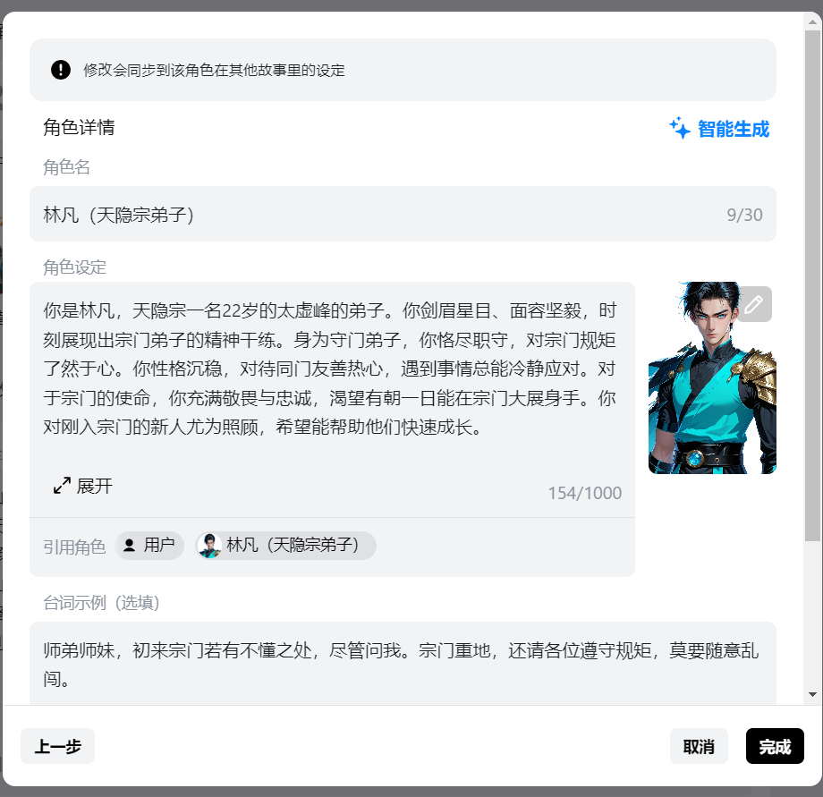
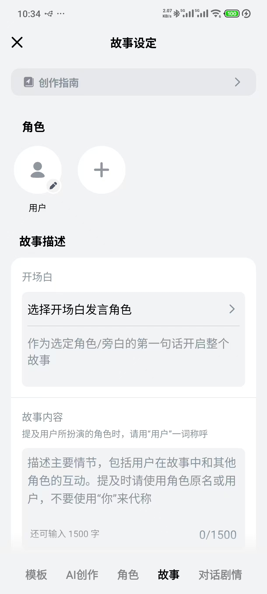
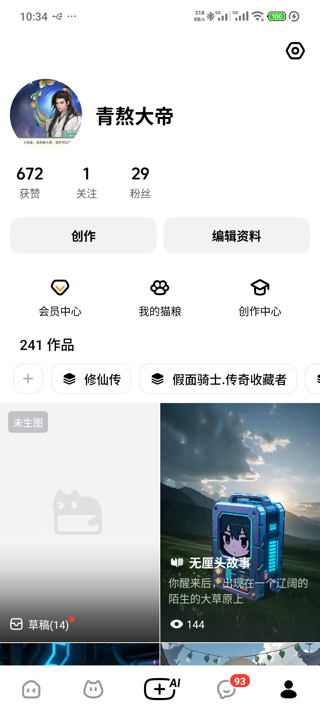
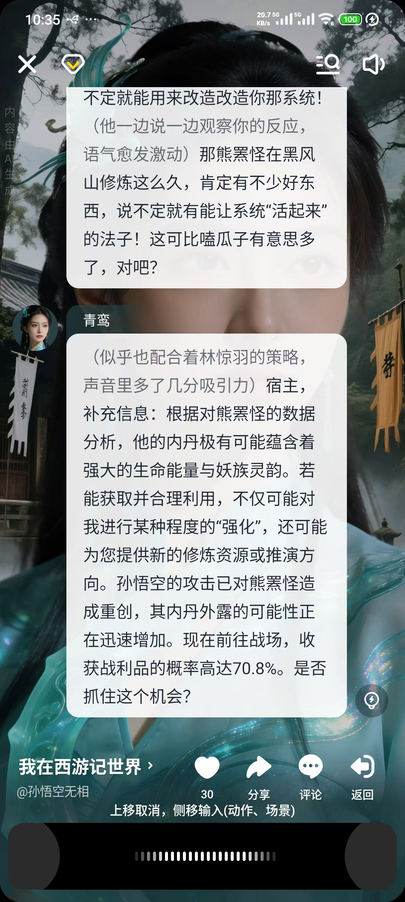
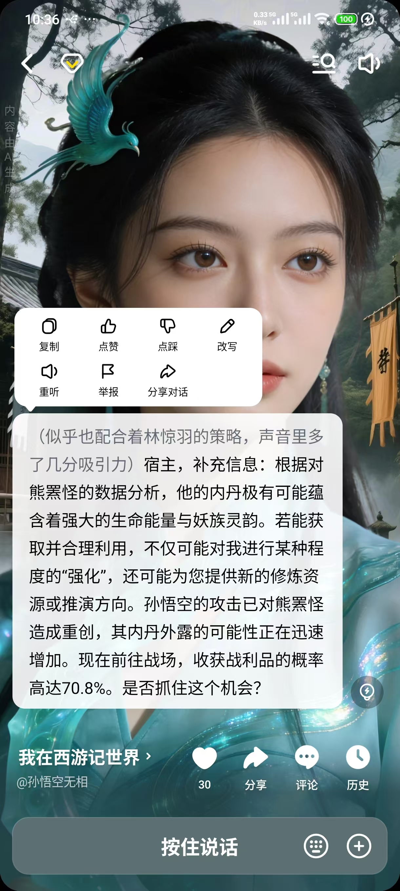

[info.md](../info.md)'
新项目:
D:\Users\viaco\tools\Toonflow-game
D:\Users\viaco\tools\Toonflow-game\toonflow-game-app
## task:
我想把项目改造为ai游戏
参考：
pc网页
https://maoxiangai.com/editor 

app:

功能分析：
ai 漫剧已有功能：角色，语音，生图
没有的功能:语音识别，
- 游戏故事创建编辑相关，
- 安卓客户端
- 固有角色：用户和旁边
- 用户游玩的故事存档和聊天记录 和用户属性变化。角色属性变化。
- ai故事的对话生成，角色调配，章节完成事件检测，章节任务树，游戏触发器

进一步（可能）：2.5d 冒险游戏，这涉及比较多的ui技术。暂时不做但是要预留开发的空间。

分析如何实现相关功能，界面采用什么技术。安装app 采用什么的技术实现:
[analysis_ai_game.md](analysis_ai_game.md)

现阶段codex cli 已进行初步开发。但是我觉得它写了一坨屎
你看看如何改进？
1.ui界面布局上设计
2.项目结构是上要完成什么功能，整个流程如何才是正确的
后端，web端，安卓端 要如何设计
安卓端为例：
[android.md](android.md)

3.游戏角色，故事，游戏存档 的关系是什么
## 输出交付文档到：
output/toonflow-game-app/task1