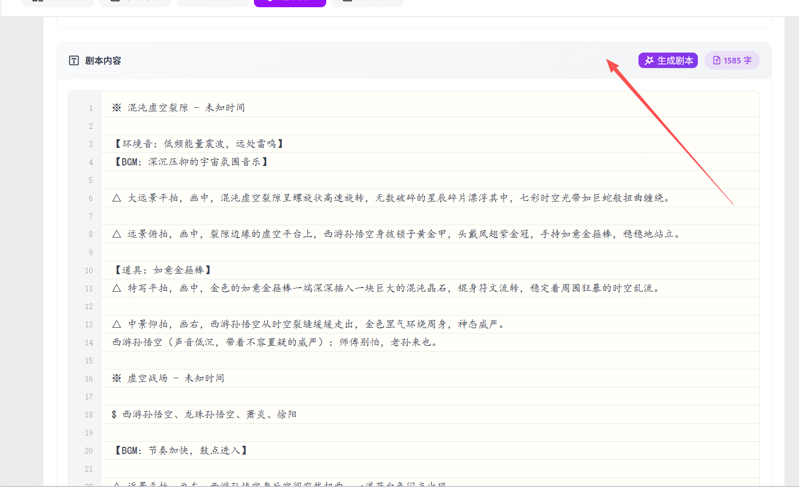
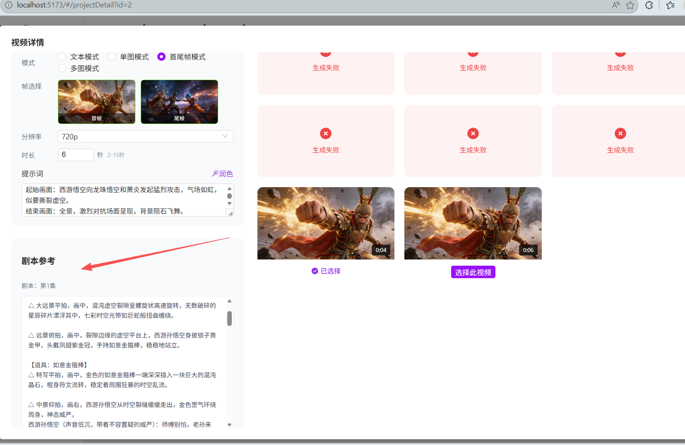

分镜画布agent生成镜头时划分的是片段，而剧情是不划分。
这样会导致不一致性。

## 1.先分析
是否剧情是否也是划分片段更好。 agent 阶段就不需要再次划分片段了

## 2.解决方案
1. 剧情划分片段，分镜画布agent 严格安装划分进行生成分镜
2. 剧情片段作为一个独立字段进行维护，分镜画布agent 严格安装划分进行生成分镜
 这里参照的是 剧情片段

## 3.结论
采用方案 `2` 更合适：

- 保留整集剧情原文，避免影响现有编辑、展示、导出流程
- 额外维护“剧情片段”结构化数据，供分镜、视频、提示词统一引用
- 分镜画布 agent 不再自己二次划分片段，而是严格读取已有剧情片段

这样可以解决“同一集剧情和分镜引用单位不一致”的问题，也能避免 agent 每次重分段导致结果漂移。

## 4.数据结构建议

### 4.1 原始剧本
继续保留现有剧本字段：

- `script.id`
- `script.projectId`
- `script.content`

作用：
- 用于整集编辑
- 用于原文展示
- 作为剧情片段的来源文本

### 4.2 新增剧情片段表
建议新增独立表，例如：`t_scriptSegment`

建议字段：

- `id`
- `scriptId`
- `projectId`
- `sort`
- `title`
- `content`
- `summary`
- `startAnchor`
- `endAnchor`
- `createdAt`
- `updatedAt`

说明：

- `sort`：片段顺序，分镜和视频都按这个顺序工作
- `title`：片段标题，便于界面展示
- `content`：片段正文
- `summary`：片段摘要，可供 agent 快速理解
- `startAnchor/endAnchor`：可选，用于定位片段在整集剧本中的位置，方便重算和回溯

## 5.业务约束

### 5.1 分镜生成
分镜画布 agent 的输入必须改为：

1. 当前剧集 script
2. 当前剧集对应的 `剧情片段`
3. 当前片段下已有分镜

约束：

- agent 不允许自行重新划分片段
- agent 只能基于 `segmentId` 生成、修改、补充分镜
- 分镜必须明确归属某个 `segmentId`

### 5.2 视频配置
视频配置也应关联到分镜或片段：

- 最低要求：视频配置能追溯到所属 `segmentId`
- 最好：视频配置通过分镜间接归属片段，同时冗余保存 `segmentId`

这样后续“按片段生成视频”“重生成某片段的视频配置”会更稳定。

### 5.3 聊天与画布
分镜助手在描述当前上下文时，应以“当前剧集 + 当前剧情片段”为核心，而不是再做一次自然语言切段。

## 6.推荐流程

### 6.1 剧本编辑后
1. 用户保存整集剧本
2. 系统生成或更新该剧集的剧情片段
3. 片段结果写入 `t_scriptSegment`

### 6.2 分镜画布
1. 读取当前剧集
2. 读取当前剧集的剧情片段
3. 画布按片段展示
4. agent 严格按片段生成分镜

### 6.3 后续重生成
支持以下粒度：

- 重生成某个剧情片段
- 重生成某个剧情片段下的分镜
- 重生成某个剧情片段下的视频配置

## 7.迁移策略

### 7.1 对新数据
新建剧本后，直接走：

- 剧本生成
- 片段生成
- 分镜生成

### 7.2 对老数据
需要补一条兼容路径：

1. 读取已有剧集原文
2. 自动生成剧情片段
3. 旧分镜尽量按标题、顺序、内容匹配回片段
4. 无法精确匹配的分镜标记为“待人工确认”

这里不要强行自动绑定全部旧数据，否则会制造更多脏数据。

## 8. 接口改造建议

建议新增或调整以下接口：

- `getScriptSegments(scriptId)`
- `generateScriptSegments(scriptId)`
- `updateScriptSegment(id, data)`
- `deleteScriptSegment(id)`

分镜接口增加：

- 生成分镜时必须传 `segmentId`
- 查询分镜时支持按 `segmentId` 过滤

## 9. 实施优先级

### P1
- 新增剧情片段表
- 当前剧集支持生成和读取剧情片段
- 分镜画布 agent 改为严格读取剧情片段

### P2
- 分镜、视频配置增加 `segmentId`
- UI 中显式展示“剧情片段”

### P3
- 老数据迁移工具
- 片段人工校对能力

## 10. 最终目标

最终统一的数据链路应为：

`剧集原文 -> 剧情片段 -> 分镜 -> 视频配置 -> 视频结果`

而不是：

`剧集原文 -> agent 临时切片 -> 分镜`

前者是可维护的数据结构，后者只是一次性推理过程，长期一定会失控。
